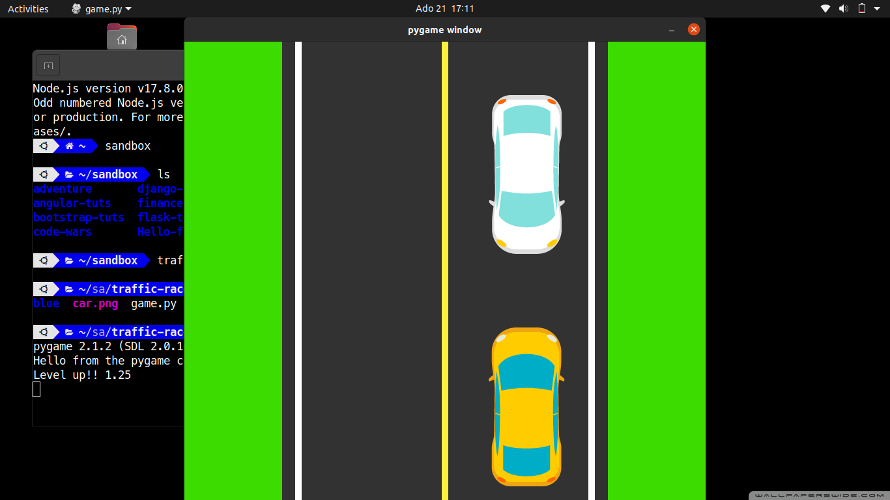

# traffic-racer
## Description
A traffic racing game built using pygame.

### Screenshot

### Prerequisites

The game requires Python and you can install python for your specific operating system by following this documentation [Python download](https://www.python.org/downloads/) and also pygame using the following command `python3 -m pip install -U pygame --user` or you can follow this [pygame docs](https://www.pygame.org/wiki/GettingStarted#Pygame%20Installation)

## Getting Started

- Clone this repository to your computer. `git clone https://github.com/Clinton-dev/traffic-racer.git`
- Open terminal command line then navigate to the root folder `cd traffic-racer`
- To start the game run `python game.py`

## Built With

* [python](https://docs.python.org/3/) - language used
* [pygame ](https://www.pygame.org/docs/) - gaming framework
